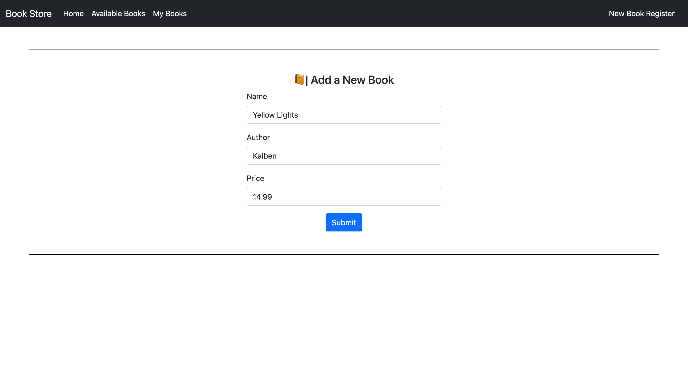
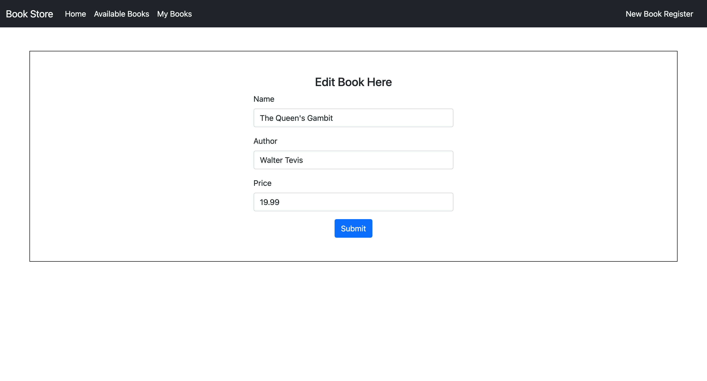

# Welcome to Our Bookstore! 📚

Welcome to our Bookstore, where you can embark on a literary adventure and explore a vast collection of books. Whether you're a seasoned reader or just beginning your journey into the world of literature, we have something special in store for you. 🌟

## Features 🚀

Here's what you can do on our website:

1. **Add Your Own Books**: Share your favorite reads with the community! Contribute to our ever-growing catalog by adding your own books to the collection. 

2. **Explore Available Books**: Navigate to the "Available Books" section to discover a comprehensive list of books with details such as their titles, authors, and prices. Browse through the selection and find your next captivating read.

3. **Add Books to Cart**: Found a book you love? Simply add it to your list to reserve your copy and ensure it's part of your collection. 🛒

4. **Manage Your Collection**: In the "My Books" section, you'll find a personalized list of all the books you've added to your collection. From here, you can remove books, edit their information, and keep track of your literary treasures. ✏️

## Requirements 👾

This website requires MySQL to function properly. Ensure you have MySQL installed and configured, alongside with Maven and Java. 

## Youtube demo showcasing this project: https://youtu.be/1CmqutIDx_0

### Built using: Java, Spring Web, Thymeleaf, Spring Data JPA (Java Persistence API), MySQL Database, BootStrap 5, DevTools, Maven.

## Build 💻

Navigate to `./bookStore/` then run: 

    java -jar target/bookStore-0.0.1-SNAPSHOT.jar

 
    
>NOTE: After setting up MySQL, make sure to tweak settings in the `./bookStore/src/main/resources/application.properties` file such as the port number, MySQL host name, password and other settings as necessary to ensure the application can connect to your local MySQL server. By default they are configured to connect to `root` with the password: `root`.

Then navigate to `http://localhost:{specified port number in application.properties}/` and the website should be displayed!

